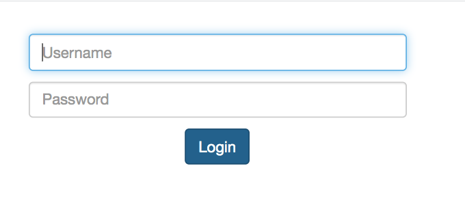
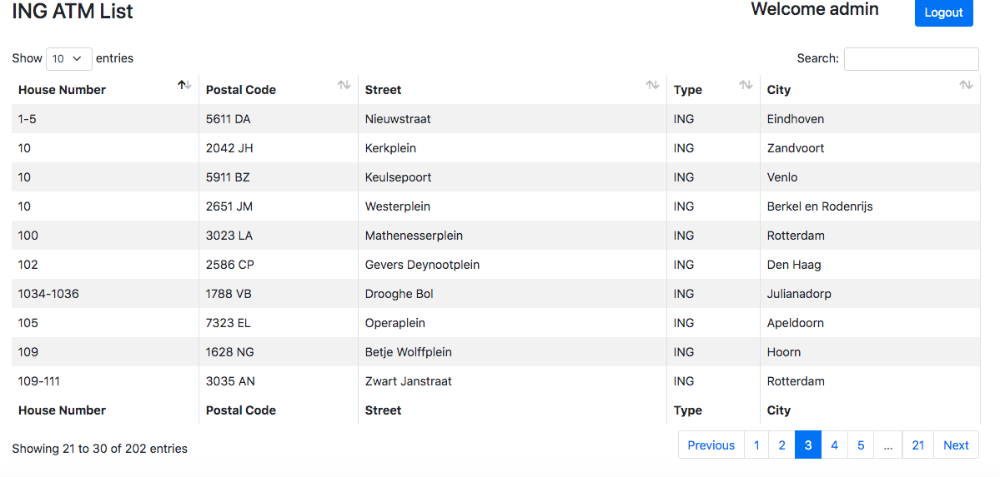

# ING ATM Finder
> Show list of all the ATM centers of Dutch city in Datatable

# Screenshots
| Login  | Home |
| ------------- | ------------- |
|   |   |

## Tools & Framework
> Apache Camel
>
> Spring boot
>
>Spring Security
>
>Thymeleaf
>
>Maven
>
>JUnit
>
>Tomcat

## Camel Timer Config

Timer route is intended to execute on application start up and call external webservice to fetch all ATM ceter list

```java
/* Set Timer to call external web service to fetch all ATM on startup of the application
            Take care of invalid json and unmarshal it to List<ATMDetail>
        */
        from("timer:Timer?repeatCount=1")
                .setBody(simple("${null}")).routeId("process-atm-details-timer")
                .to(ingATMLocatorURL + "?httpMethod=GET")
                .process((exchange) -> {
                    String body = exchange.getIn().getBody(String.class);
                    if(!body.startsWith("[")) {
                        body = body.substring(body.indexOf("["));
                    }
                    exchange.getIn().setBody(body);
                }).unmarshal(new ListJacksonDataFormat(ATMDetail.class))
                .bean(ATMFinder.class, "processATMDetails");
```

## Camel REST route config

```java
// Configure REST and set contextPath
        restConfiguration()
                .component("servlet")
                .contextPath("/ing-atm-finder")
                .port(port)
                .bindingMode(RestBindingMode.json);

// REST route configuration
        rest("/atm").description("ATM REST")
                .get("/").description("Fetch list of all the atm across cities")
                    .produces(MediaType.APPLICATION_JSON_VALUE)
                    .route().routeId("list-atm-api")
                    .bean(ATMFinder.class, "findAll")
                    .endRest()
                .get("/{city}").description("Fetch list of all the atm for given city")
                    .produces(MediaType.APPLICATION_JSON_VALUE)
                    .route().routeId("list-atm-by-city-api")
                    .bean(ATMFinder.class, "findByCity(${header.city})")
                    .endRest()
                .get("/cities").description("Fetch list of all the atm cities of ING ATM")
                    .produces(MediaType.APPLICATION_JSON_VALUE)
                    .route().routeId("list-city-api")
                    .bean(ATMFinder.class, "findAllCities()")
                    .end();
```
All REST API calls will be handled by camel REST routes (i.e. /ing-atm-finder/atm, /ing-atm-finder/cities, /ing-atm-finder/{city})

## Login Credentials
```
Username : admin
Password : admin
```

## Run artifact

```
./mvnw spring-boot:run
```

